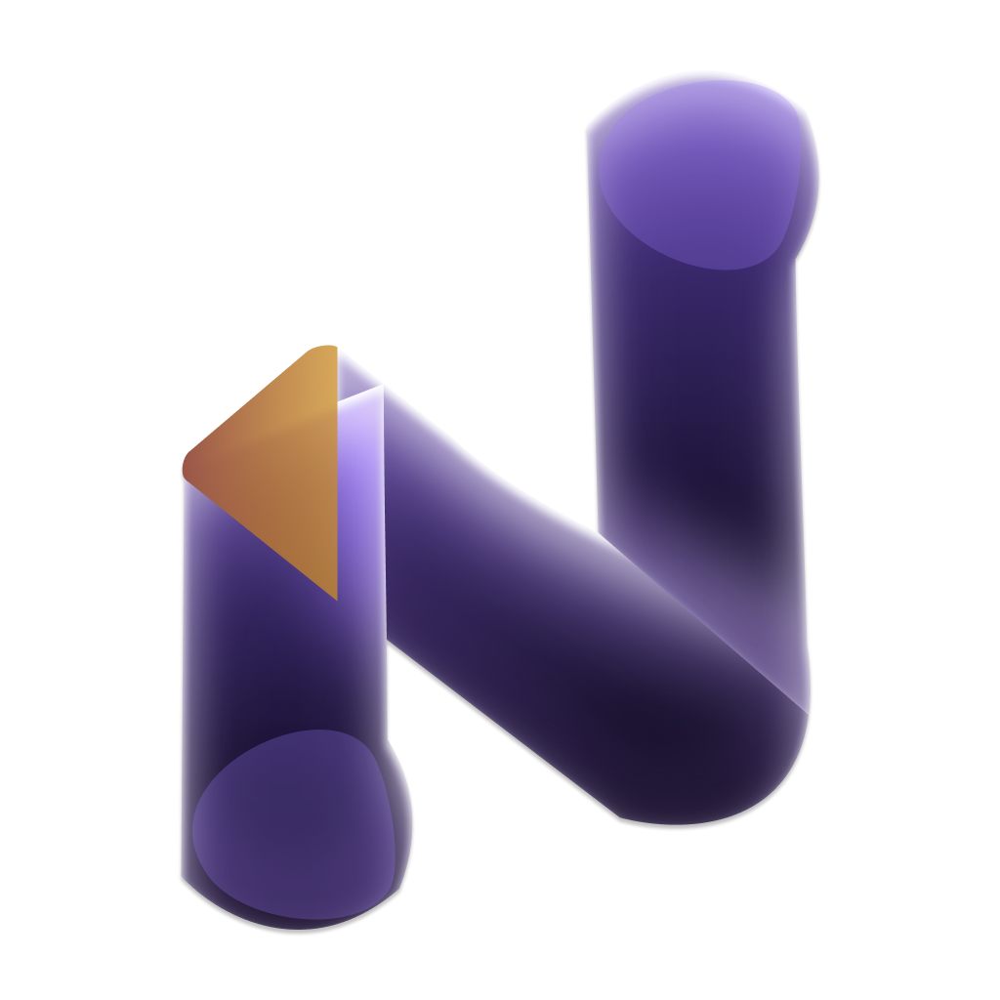

# Neolyx OS

<div align="center">



**A modern, fully functional 64-bit desktop operating system built from scratch**

[](LICENSE)
[](CONTRIBUTING.md)
[](CODE_OF_CONDUCT.md)
[](https://neolyx.ketivee.com/)
[](https://neolyx.ketivee.com/donate)

</div>

## Overview

Neolyx OS is a modern operating system designed from the ground up with a focus on performance, extensibility, and modern hardware support. It features a custom UEFI bootloader, a 64-bit C kernel, a graphical desktop environment, the NXFS file system, networking capabilities, and a package manager.

## Key Features

- **64-bit UEFI Bootloader** - Modern boot process with UEFI support
- **Custom C Kernel** - Multitasking, memory management, and process scheduling
- **NXFS File System** - Custom file system optimized for performance
- **Graphical Desktop** - Full desktop environment with window management
- **Network Stack** - TCP/IP implementation with network manager
- **Package Manager** - nxpkg for software installation and .app support
- **Hardware Support** - Modular drivers for GPU (NVIDIA), storage, input, and network
- **Custom UI** - Icon library and file explorer
- **Extensible Design** - Built for customization and expansion

## Quick Start

### Prerequisites

- GCC cross-compiler for x86_64-elf
- NASM assembler
- GNU Make
- QEMU (for testing)
- UEFI firmware (OVMF)

### Building

```bash
# Clone the repository
git clone https://github.com/KetiveeAI/NeolyxOS.git
cd NeolyxOS

# Build the OS
make clean
make all
```

### Running

```bash
# Test in QEMU
./boot_test.sh
```

## Documentation

- [Project Structure](PROJECT_STRUCTURE.md) - Detailed codebase breakdown
- [Architecture](Architecture.md) - System architecture overview
- [Boot Runtime](BootRuntime.md) - Boot process documentation
- [Contributing Guide](CONTRIBUTING.md) - How to contribute
- [Support](SUPPORT.md) - Getting help

## Contributing

We welcome contributions from developers of all skill levels! Whether you're fixing bugs, adding features, improving documentation, or designing icons, your help is appreciated.

Please read our [Contributing Guide](CONTRIBUTING.md) to get started.

### Ways to Contribute

- 🐛 Report bugs and issues
- 💡 Suggest new features
- 📝 Improve documentation
- 🎨 Design icons and UI elements
- 💻 Write code and fix bugs
- 🧪 Test and provide feedback

## Community

- **Website**: [neolyx.ketivee.com](https://neolyx.ketivee.com/)
- **Issues**: [Report bugs or request features](https://github.com/KetiveeAI/NeolyxOS/issues)
- **Pull Requests**: [Submit your contributions](https://github.com/KetiveeAI/NeolyxOS/pulls)
- **Code of Conduct**: [Read our community guidelines](CODE_OF_CONDUCT.md)
- **Support Us**: [Donate to the project](https://neolyx.ketivee.com/donate)

## Project Structure

```
neolyx-os/
├── boot/          # Bootloader code
├── kernel/        # Kernel implementation
├── desktop/       # Desktop environment
├── gui/           # GUI components
├── lib/           # System libraries
├── drivers/       # Hardware drivers
├── nxrt/          # Runtime environment
├── services/      # System services
└── tools/         # Build and development tools
```

See [PROJECT_STRUCTURE.md](PROJECT_STRUCTURE.md) for detailed information.

## License

See [LICENSE](LICENSE) file for details.

## Security

Found a security vulnerability? Please read our [Security Policy](SECURITY.md) for responsible disclosure.

## Acknowledgments

Thank you to all contributors who have helped make Neolyx OS possible!

---

<div align="center">

**[Website](https://neolyx.ketivee.com/)** • **[Documentation](PROJECT_STRUCTURE.md)** • **[Contributing](CONTRIBUTING.md)** • **[Support](SUPPORT.md)** • **[Donate](https://neolyx.ketivee.com/donate)**

Made with ❤️ by the Neolyx OS community & KetiveeAI

</div> 